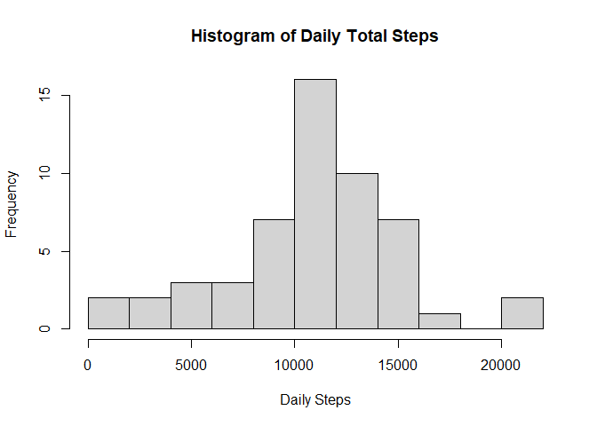
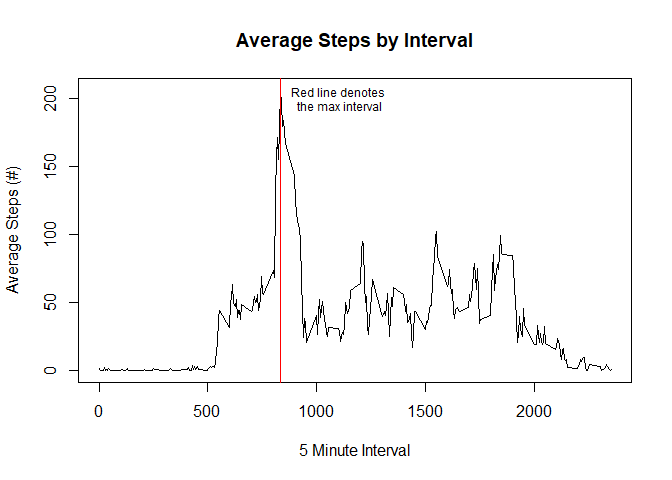
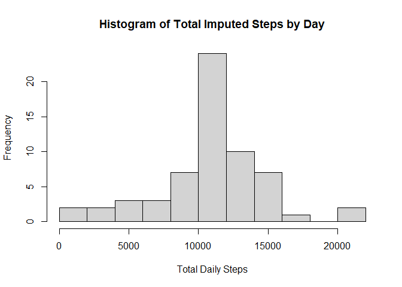
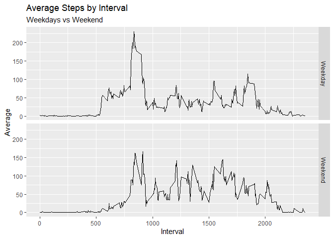

## Loading and preprocessing the data

```r
library(dplyr)
```

```
## 
## Attaching package: 'dplyr'
```

```
## The following objects are masked from 'package:stats':
## 
##     filter, lag
```

```
## The following objects are masked from 'package:base':
## 
##     intersect, setdiff, setequal, union
```

```r
library(ggplot2)

#unzip('activity.zip')

data <- read.csv('activity.csv', header = TRUE)
data$date <- as.Date(data$date)

data.daily <- data %>% group_by(date) %>% summarise(total_steps = sum(steps,na.rm = FALSE))

hist(data.daily$total_steps, breaks = 10, main = 'Histogram of Daily Total Steps',
     xlab = 'Daily Steps')
```

<!-- -->


## What is mean total number of steps taken per day?

```r
data.summary <- summary(data.daily$total_steps)
```
The median of the total number of steps taken per day is 1.0765\times 10^{4} and the mean is 1.0766189\times 10^{4}.


## What is the average daily activity pattern?


```r
data.increments <- data %>% group_by(interval) %>% summarise(avg = mean(steps, na.rm = TRUE))

max_interval <- data.increments$interval[which(data.increments$avg==max(data.increments$avg))]

plot(data.increments$interval, data.increments$avg, type = 'l', 
     main = 'Average Steps by Interval', xlab = '5 Minute Interval',
     ylab= 'Average Steps (#)')
abline(v=c(835), col='red')
text(x = 1100, y=200, labels = 'Red line denotes\n the max interval', cex=0.75)
```

<!-- -->
The 835th interval averages the highest numbers of steps per day.

## Imputing missing values

```r
missing_vals <- table(is.na(data))[2]

#impute the missing values by using the mean value for the interval across all days
data.imputed <- data %>% left_join(data.increments) %>% mutate(imputed_steps = ifelse(is.na(steps),round(avg),steps)) %>% select(imputed_steps, date, interval)
```

```
## Joining, by = "interval"
```

```r
data.imputed.daily <- data.imputed %>% group_by(date) %>% 
  summarise(total=sum(imputed_steps))


hist(data.imputed.daily$total,breaks=10, 
     main = 'Histogram of Total Imputed Steps by Day',
     xlab='Total Daily Steps')
```

<!-- -->

```r
summary(data.imputed.daily$total) #- data.summary
```

```
##    Min. 1st Qu.  Median    Mean 3rd Qu.    Max. 
##      41    9819   10762   10766   12811   21194
```

```r
data.summary
```

```
##    Min. 1st Qu.  Median    Mean 3rd Qu.    Max.    NA's 
##      41    8841   10765   10766   13294   21194       8
```
There are 2304 missing values across the entire dataset.  The impact of imputed values for the missing step counts is relatively low based on the summary.

## Are there differences in activity patterns between weekdays and weekends?

```r
data.imputed$day_type <- ifelse(strftime(data.imputed$date,'%u') %in% c('6','7'),
                                'Weekend','Weekday')

ggplot(data.imputed %>% group_by(day_type, interval) %>%
         summarise(avg=mean(imputed_steps)), aes(interval, avg)) + 
  geom_line() + facet_grid(day_type~.) +
  ggtitle('Average Steps by Interval', subtitle = 'Weekdays vs Weekend') + 
  xlab('Interval') + ylab('Average') + labs(color = 'Day Type')
```

<!-- -->


